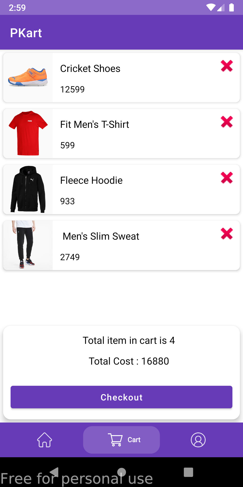
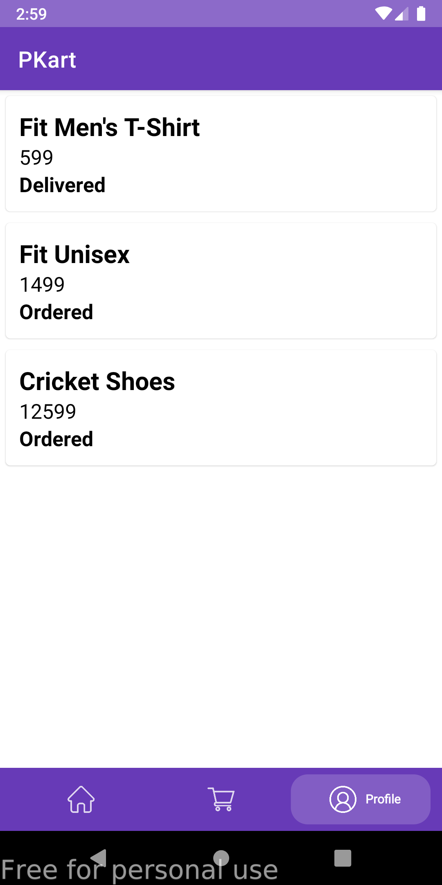

## Ecommerce app in android studio with kotlin firebase and razorpay

<a id="raw-url" href="apk/PKart.apk?raw=true">
</a>

## Screenshots

|                                       Home           |                            Cart                          |                            Profile                      |
| :------------------------------------------------------------------: | :-----------------------------------------------------------------: | :------------------------------------------------------------------: |
|   |  |    |


## Ecommerce app

- It consist of 2 apps one for ecommerce user app and another for ecommerce customer app.
From customer app user can register / login, add product to cart, order it and pay money online via razorpay payment gateway integration.
From Admin app admin can control all the things in user app.
Admin can add category, delete category, add products, can approve order request, proceed for order delivery.


```
Learning Points : 
Kotlin Language.
Room Database.
Firestore database.
Phone Number Authentication with firebase.
Razorpay payment gateway integratio
```

